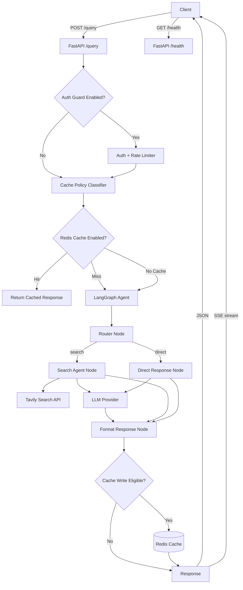
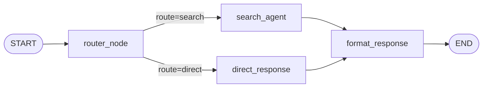

# Application Architecture

## Runtime Flow

## LangGraph Node Flow

## Notes

- `router_node` uses deterministic rules for time-critical finance queries, then LLM intent classification for everything else.
- `search_agent` retrieves results (or uses cached results), sanitizes untrusted content, and synthesizes with source references.
- `format_response` appends numbered sources for search-routed responses.
