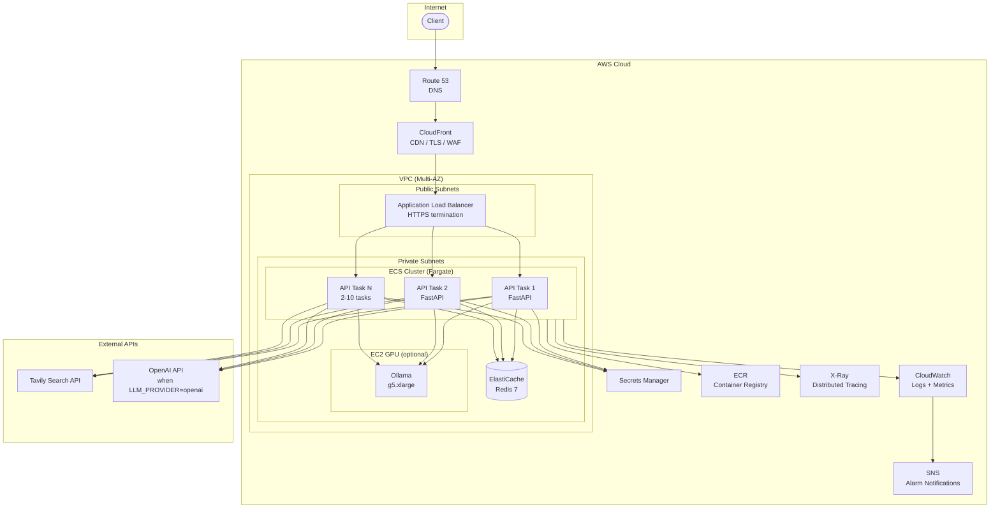

# Deployment Architecture

This document describes the production deployment strategy for the Financial Research Agent on AWS, covering infrastructure topology, scaling policies, reliability, security, observability, and CI/CD integration.

## Table of Contents

- [Architecture Overview](#architecture-overview)
- [Component Details](#component-details)
- [Network Topology](#network-topology)
- [Scaling Strategy](#scaling-strategy)
- [Reliability and Fault Tolerance](#reliability-and-fault-tolerance)
- [Security](#security)
- [Observability](#observability)
- [CI/CD Pipeline](#cicd-pipeline)
- [Cost Considerations](#cost-considerations)
- [Local-to-Production Parity](#local-to-production-parity)
- [Design Decisions](#design-decisions)

---

## Architecture Overview



**ASCII fallback** (for terminals without Mermaid rendering):

```
Client → Route 53 → CloudFront (CDN/TLS/WAF) → ALB
                                                  │
                     ┌────────────────────────────┘
                     │        ECS Fargate (Private Subnets)
                     ├──→ API Task 1 ──┬──→ ElastiCache (Redis)
                     ├──→ API Task 2 ──┤──→ Ollama GPU (optional)
                     └──→ API Task N ──┤──→ Tavily API (external)
                          (2–10)       └──→ OpenAI API (external)

Supporting services: ECR, Secrets Manager, CloudWatch, X-Ray, SNS
```

---

## Component Details

### Why each component was chosen

| Component | Service | Justification |
|---|---|---|
| **Compute** | ECS Fargate | No server management, per-task scaling, native Docker support. Fargate avoids EC2 fleet ops while still supporting long-lived SSE connections. |
| **GPU inference** | EC2 g5.xlarge (optional) | Only needed when `LLM_PROVIDER=ollama`. Fargate lacks GPU support, so a dedicated EC2 instance behind a service discovery endpoint is used. When using OpenAI, this component is not deployed. |
| **Cache + Rate Limiting** | ElastiCache Redis 7 | The application already uses Redis for multi-tier caching and rate-limit counters. ElastiCache provides managed replication, failover, and encryption at rest. |
| **Load Balancer** | ALB | Layer 7 routing, native SSE/HTTP streaming support, health checks with automatic target deregistration. |
| **CDN / Edge** | CloudFront | TLS termination at edge, geographic latency reduction for global clients, integrated WAF rules. |
| **DNS** | Route 53 | Alias records to CloudFront, health-check-based failover if multi-region is added later. |
| **Secrets** | Secrets Manager | Rotation-capable secret store for `TAVILY_API_KEY`, `OPENAI_API_KEY`, and `API_KEY_HASHES`. Injected into ECS tasks as environment variables at launch. |
| **Container Registry** | ECR | Private registry with vulnerability scanning. CI pushes versioned images on every release. |
| **Observability** | CloudWatch + X-Ray | Native ECS integration, no sidecar needed for log collection. X-Ray traces requests across API, LLM, and search calls. |

---

## Network Topology

```
VPC: 10.0.0.0/16

  Public subnets (2 AZs):
    10.0.1.0/24  (AZ-a)  — ALB, NAT Gateway
    10.0.2.0/24  (AZ-b)  — ALB, NAT Gateway

  Private subnets (2 AZs):
    10.0.10.0/24 (AZ-a)  — ECS tasks, ElastiCache, Ollama
    10.0.20.0/24 (AZ-b)  — ECS tasks, ElastiCache replica
```

- **ALB** lives in public subnets, accepts inbound HTTPS (443) only.
- **ECS tasks** run in private subnets with no public IPs. Outbound traffic (to Tavily/OpenAI) routes through NAT Gateways.
- **ElastiCache** is accessible only from the private subnets via security group rules (port 6379).
- **Ollama** (if deployed) runs on a private EC2 instance, reachable via Cloud Map service discovery at `ollama.internal:11434`.

---

## Scaling Strategy

### API Service (ECS Fargate)

| Parameter | Value | Rationale |
|---|---|---|
| Min tasks | 2 | Availability across 2 AZs; no cold-start on first request |
| Max tasks | 10 | Bounded by downstream rate limits (Tavily: 1000 req/month free, OpenAI: token budget) |
| Scale-out trigger | CPU > 60% sustained 2 min, OR `RequestCountPerTarget` > 50/min | CPU catches compute-heavy LLM synthesis; request count catches I/O-bound search waits |
| Scale-in trigger | CPU < 30% sustained 5 min | Slower scale-in to avoid flapping |
| Cooldown | 60s scale-out, 300s scale-in | Asymmetric to favor availability |

Each API task runs Uvicorn with async I/O. A single task handles ~50-100 concurrent SSE connections (bound by LLM response time, ~2-10s per query). The service is fully **stateless** — no sticky sessions required for correctness, though ALB connection draining is configured for graceful SSE stream completion.

### Redis (ElastiCache)

- **Node type**: `cache.r7g.medium` (single node to start, cluster mode for >1000 req/s)
- **Scaling**: Vertical — upgrade node type if memory or throughput is exceeded
- **Eviction**: `allkeys-lru` — safe because all cached data is regenerable
- Cache reduces LLM/search calls: direct-knowledge queries (24h TTL) and non-critical search answers (5min TTL) avoid redundant external API calls

### Ollama (Optional GPU)

- **Instance**: `g5.xlarge` (1x NVIDIA A10G, 24GB VRAM) — runs qwen2.5:7b comfortably
- **Scaling**: Single instance to start; add instances behind a target group if inference throughput exceeds ~10 req/s
- **Not deployed** when `LLM_PROVIDER=openai` — the OpenAI API handles scaling transparently

---

## Reliability and Fault Tolerance

### Multi-AZ Deployment

All components span 2 Availability Zones:
- ECS tasks are distributed across AZs by the Fargate scheduler
- ElastiCache uses Multi-AZ with automatic failover
- ALB cross-zone load balancing is enabled

### Health Checks and Recovery

| Component | Health Check | Recovery |
|---|---|---|
| ECS tasks | ALB target group: `GET /health` every 15s, 2 consecutive failures → deregister | ECS replaces unhealthy tasks automatically |
| ElastiCache | Managed health checks with automatic replica promotion | Failover completes in <30s |
| Ollama | TCP check on port 11434 | Auto-restart via systemd or ECS service |

### Application-Level Resilience

The application has built-in resilience (see `app/agent/resilience.py`):

- **Typed error hierarchy**: `SearchTimeoutError`, `SearchRateLimitError`, `LLMBackendError`, etc.
- **Retry with exponential backoff**: 3 attempts, 0.2s → 0.4s → 0.8s delays for transient failures
- **Fail-closed auth**: If Redis is unavailable, the rate limiter returns 503 rather than allowing unbounded traffic
- **Empty search fallback**: Returns an explicit uncertainty message ("I couldn't find any current web results...") rather than hallucinating
- **Cache degradation**: If Redis is down, the service continues without caching — higher latency but functional

### Failure Scenarios

| Failure | Impact | Mitigation |
|---|---|---|
| Tavily API down | Search queries fail | Retry 3x with backoff → return 503 with `search_backend_unavailable` code. Direct queries unaffected. |
| OpenAI API down | All queries fail (if OpenAI provider) | Retry 3x → return 503. Consider fallback to Ollama as future enhancement. |
| Redis down | No caching, auth fails closed | API returns 503 for authenticated requests. If `AUTH_ENABLED=false`, service continues without cache. |
| Single AZ failure | ~50% task capacity lost | ALB routes to healthy AZ; ECS auto-scaling replaces tasks in surviving AZ. |

---

## Security

### Network Security

- **No public IPs** on ECS tasks or Redis — all traffic routed through ALB or NAT Gateway
- **Security groups**:
  - ALB: inbound 443 from `0.0.0.0/0`
  - ECS tasks: inbound 8000 from ALB security group only
  - Redis: inbound 6379 from ECS task security group only
  - Ollama: inbound 11434 from ECS task security group only
- **WAF on CloudFront**: Rate limiting (per-IP), geo-blocking (optional), SQL injection / XSS rule sets

### Secret Management

- All API keys (`TAVILY_API_KEY`, `OPENAI_API_KEY`, `API_KEY_HASHES`) stored in **AWS Secrets Manager**
- Injected into ECS task definitions as environment variables via `secrets` block (not plaintext in task def)
- Secrets are never logged — the application filters them from error output

### Application Security

- **API key authentication**: SHA256-hashed keys with constant-time comparison (`hmac.compare_digest`)
- **Rate limiting**: Per-key and per-IP sliding window counters (60/min, 600/hr default)
- **Prompt injection defense**: 6-layer sanitization of untrusted search content before LLM context (see `app/agent/nodes.py`)
- **Input validation**: Pydantic enforces query length 1-2000 characters
- **TLS everywhere**: CloudFront → ALB (HTTPS), ALB → ECS (HTTP within VPC — acceptable for private subnet)

### Dependency Security

- Dependencies pinned in `uv.lock`
- Container base image: `python:3.12-slim` (minimal attack surface)
- ECR vulnerability scanning enabled on push

---

## Observability

### Logging

- **Destination**: CloudWatch Logs via `awslogs` log driver (built into Fargate)
- **Format**: Python `logging` module with structured fields
- **Log groups**: `/ecs/financial-research-agent/api`, `/ecs/financial-research-agent/ollama`
- **Retention**: 30 days (configurable)

**Key log events**:
- Route decisions with intent classification reasoning
- Cache hits/misses per policy tier
- External service errors with typed codes
- Retry attempts with delay and attempt number

### Metrics

Custom CloudWatch metrics published via embedded metric format:

| Metric | Dimensions | Purpose |
|---|---|---|
| `QueryLatency` | Route (search/direct), CacheHit (true/false) | P50/P95/P99 response time |
| `RouteDistribution` | Route | Search vs direct query ratio |
| `CacheHitRate` | Tier (direct/search_results/search_answer) | Cache effectiveness |
| `ExternalServiceErrors` | Service (tavily/openai/ollama), ErrorCode | Dependency health |
| `RateLimitRejections` | Scope (key_id/ip) | Abuse detection |

### Distributed Tracing

- **X-Ray** traces each request across:
  - FastAPI endpoint → LangGraph router → search/direct node → format node
  - Outbound calls to Tavily, OpenAI/Ollama, and Redis
- Trace ID propagated via `X-Amzn-Trace-Id` header

### Alarms

| Alarm | Threshold | Action |
|---|---|---|
| API error rate | >5% 5xx responses over 5 min | SNS → PagerDuty/Slack |
| Query latency P95 | >15s over 5 min | SNS notification |
| ECS task count | <2 running tasks | SNS → immediate investigation |
| Redis CPU | >80% over 10 min | SNS → consider scaling |
| External API error rate | >20% failures over 5 min | SNS → check Tavily/OpenAI status |

---

## CI/CD Pipeline

The release pipeline uses GitHub Actions with semantic versioning driven by Conventional Commits.

### Pull Request Flow

```
Push to PR branch
  → lint (ruff format + ruff check)
  → unit tests + acceptance tests (mocked, no external deps)
  → docker build (verify image builds)
  → e2e tests (container with real OpenAI + Tavily)
```

All gates must pass before merge. See `.github/workflows/ci.yml`.

### Release Flow (on merge to `main`)

```
Merge to main
  → python-semantic-release (bump version from commit messages)
  → docker build + tag (version + latest)
  → push to GHCR (ghcr.io/<repo>:v1.5.0, ghcr.io/<repo>:latest)
  → sphinx-build → deploy to GitHub Pages
```

See `.github/workflows/release.yml`.

### Deployment to AWS

After GHCR push, deploy to ECS via one of:

1. **ECS rolling update** (recommended): Update task definition with new image tag → ECS performs rolling replacement with health check gates
2. **Blue/green via CodeDeploy**: Route ALB traffic from old target group to new after health checks pass — zero-downtime with instant rollback

```bash
# Example: update ECS service to new image
aws ecs update-service \
  --cluster financial-research-agent \
  --service api \
  --force-new-deployment \
  --task-definition api:latest
```

---

## Cost Considerations

Estimated monthly costs for a moderate-traffic deployment (~10k queries/day):

| Component | Spec | Est. Monthly Cost |
|---|---|---|
| ECS Fargate (API) | 2 tasks baseline × 0.5 vCPU, 1GB RAM | ~$30 |
| ECS Fargate (burst) | Up to 10 tasks during peaks | ~$80 peak |
| ElastiCache | `cache.r7g.medium` single node | ~$100 |
| CloudFront | <1TB transfer | ~$10 |
| ALB | 1 ALB + LCU hours | ~$25 |
| Secrets Manager | 3 secrets | ~$2 |
| CloudWatch | Logs + metrics + alarms | ~$15 |
| NAT Gateway | 2 gateways (Multi-AZ) | ~$65 |
| **Subtotal (OpenAI mode)** | | **~$250-325/mo** |
| Ollama GPU (optional) | 1× g5.xlarge on-demand | +~$760/mo |

**Cost optimization levers**:
- Use OpenAI mode to avoid GPU costs (recommended for low-medium traffic)
- Fargate Spot for non-critical workloads (API tasks are stateless, safe for spot)
- Reserved capacity for ElastiCache if traffic is predictable
- Cache hit rates directly reduce Tavily/OpenAI API costs

---

## Local-to-Production Parity

The same Docker image runs locally and in production. Environment differences are handled entirely through environment variables:

| Concern | Local (`docker compose`) | Production (AWS) |
|---|---|---|
| Compute | Docker Desktop | ECS Fargate |
| LLM | Ollama container or OpenAI API | Ollama on EC2 or OpenAI API |
| Cache | Redis container | ElastiCache Redis |
| Secrets | `.env` file | Secrets Manager |
| TLS | None (localhost) | CloudFront + ALB |
| DNS | `localhost:8000` | Route 53 → custom domain |

The `Dockerfile` uses a single-stage build with `uv sync --frozen` to ensure identical dependencies across environments.

---

## Design Decisions

| Decision | Choice | Alternative Considered | Why |
|---|---|---|---|
| Fargate over EC2 | Fargate | Self-managed EC2 ASG | Eliminates instance management; API tasks are lightweight and don't need OS-level tuning |
| ALB over API Gateway | ALB | API Gateway + Lambda | SSE streaming requires long-lived connections; Lambda has 30s timeout and no native SSE support |
| ElastiCache over DynamoDB | Redis | DynamoDB DAX | Application already uses Redis for rate limiting + caching; single dependency is simpler |
| Single region | us-east-1 | Multi-region | Right-sized for assignment scope; multi-region adds complexity without proportional benefit for a single-team service |
| GHCR over ECR for CI | GHCR | ECR | GitHub Actions has native GHCR auth; production ECS pulls from ECR via replication or direct GHCR access |
